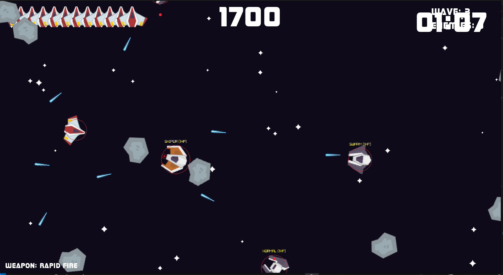
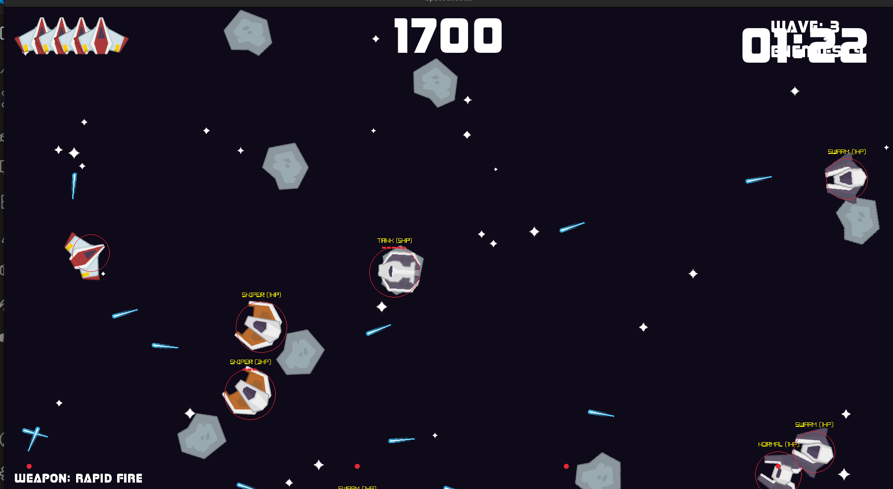
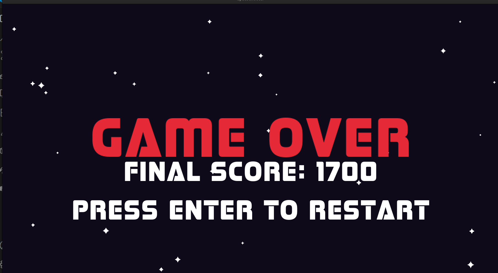
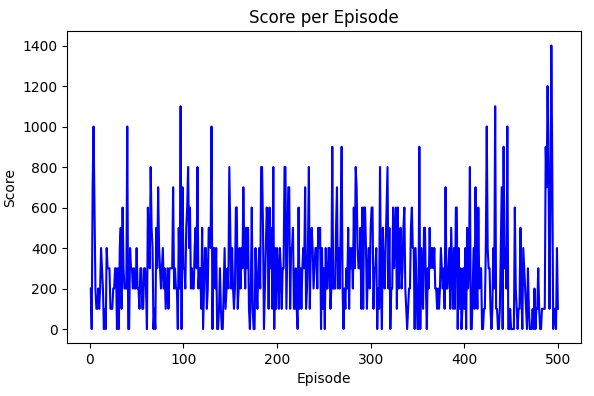
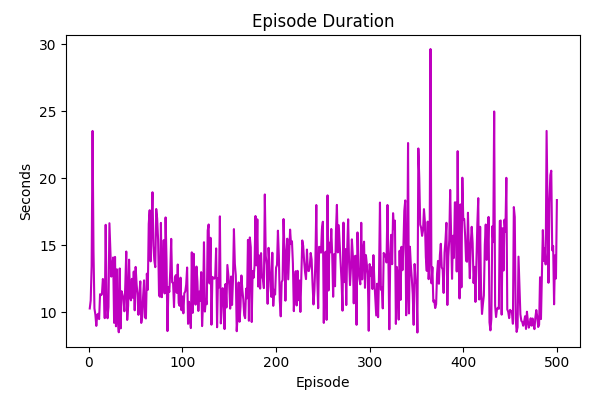
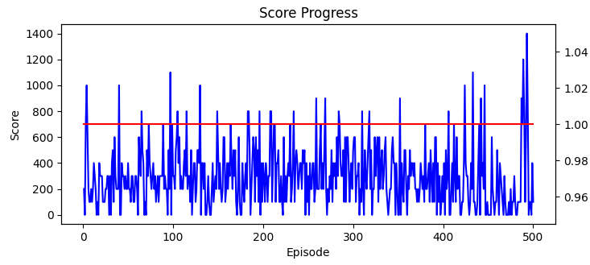
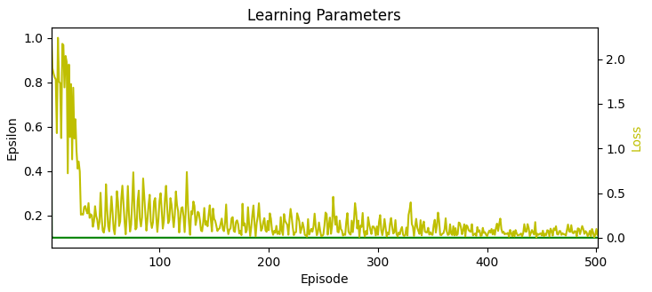
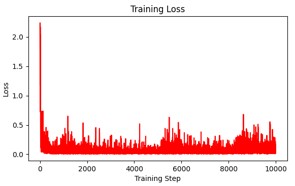
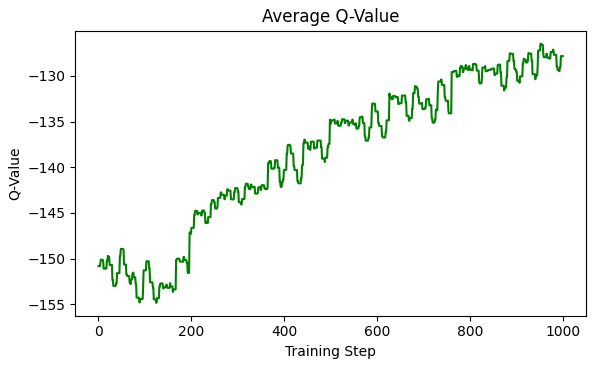

# 🧠 Adaptive Game AI: Reinforcement Learning & Evolutionary Enemies

This project is an **AI sandbox** that brings together **Deep Reinforcement Learning (DRL)** and **Genetic Algorithms (GA)** in a game-like simulation. It demonstrates how modern AI can **learn, adapt, and evolve strategies** dynamically — the player is trained via reinforcement learning while enemies evolve genetically to counter the player.

Think of it as **chess between two AIs**: one learns by experience, the other adapts by evolution.

---

## 🤖 Core AI Components

### 🚀 Reinforcement Learning Agent
- **Dueling Deep Q-Network (DQN)** – separates state value and action advantage, improving stability.
- **Attention Module** – simplified self-attention to focus on critical features in the game state.
- **Prioritized Experience Replay (PER)** – samples important experiences more frequently for faster convergence.
- **Double DQN** – reduces overestimation bias when selecting optimal actions.
- **Action Masking** – prevents illogical actions (e.g., firing with no enemies in front).
- **Intrinsic Motivation** – novelty-based rewards to encourage exploration of unseen states.
- **Temporal State Tracking** – history buffers capture velocities & movement patterns for better decision-making.

### 👾 Genetic Algorithm (for Enemies)
- **Genome Encoding** – speed, health, aggressiveness, firing rate, formation cohesion, and evasion tendencies.
- **Selection Mechanisms** – tournament-based selection favors higher-fitness genomes.
- **Crossover & Mutation** – new generations combine traits and introduce diversity.
- **Fitness Function** – balances multiple factors:
  - 🕒 survival time
  - 🎯 accuracy & hit rate
  - 💥 damage dealt
  - ⚡ efficiency of attack
- **Emergent Behavior** – over generations, enemies develop tactics like spacing, aggression bursts, or evasion.

### 🌊 Neural Wave Manager
- **Adaptive Wave Generation** – adjusts enemy composition dynamically via neural network guidance.
- **Curriculum-Like Difficulty Scaling** – waves get progressively more complex as both player and enemies improve.

---

## 🛠️ Technology Stack

- **Language**: Python 3.8+
- **Deep Learning**: PyTorch
- **Numerical**: NumPy
- **Visualization**: Matplotlib
- **Techniques**:
  - Dueling DQN
  - Attention Mechanisms
  - Double DQN + PER
  - Evolutionary Algorithms (Selection, Crossover, Mutation)
  - Intrinsic Motivation for RL

---

## 🚀 Installation & Setup

### Prerequisites
```bash
pip install torch numpy matplotlib
```

### Clone and Run
```bash
git clone https://github.com/yourusername/adaptive-game-ai.git
cd adaptive-game-ai

# Train the reinforcement learning agent
python train_agent.py

# Run genetic evolution for enemy populations
python evolve_enemies.py
```

---

## 📂 Project Structure
```
ai/
├── drl_agent.py       # Deep RL agent (Dueling DQN + Attention + PER)
├── genetic.py         # Genetic algorithm for evolving enemy genomes
├── neural_wave.py     # Adaptive wave generation via neural nets
├── utils.py           # Shared training utilities (saving/loading, logging)
└── models/            # Saved checkpoints & evolved states
```

---
## 🎨 RL GamePlay




---
## 📊 Training & Evolution Insights

- **Reinforcement Learning**
  - Epsilon decay curve → shows exploration vs exploitation
  - Q-value progression → stability of learned policy
  - Action distribution → how the agent balances movement, shooting, weapon use

- **Genetic Algorithm**
  - Fitness evolution → average vs best genome per generation
  - Mutation impact → diversity vs convergence
  - Emergent enemy strategies → new movement/attack patterns

---
## 📊 Training & Evaluation Results

### 🔥 Agent Performance







---
## 🗺️ Roadmap

- [ ] **Multi-Agent Training**: Train multiple RL agents to cooperate or compete.
- [ ] **Hybrid Neuroevolution**: Combine GA with neural networks for enemy controllers.
- [ ] **Boss AI**: Create specialized boss enemies with evolving abilities.
- [ ] **Curriculum Learning**: Gradually increase difficulty in structured phases.
- [ ] **Transfer Learning**: Apply learned models to new environments or mechanics.
- [ ] **Visualization Dashboard**: Interactive plots for RL and GA progress.
- [ ] **Cloud Training Support**: Enable large-scale distributed experiments.

---

## 🙏 Acknowledgments

- **PyTorch**: For robust deep learning tools
- **Reinforcement Learning Research**: Double DQN, PER, and attention mechanisms
- **Evolutionary Computation**: Classic GA techniques for adaptive enemy behavior
- **Game AI inspiration**: From arcade shooters to modern adaptive AI

---

✨ *This project is both a research playground and a practical demo of how RL and evolutionary algorithms can create emergent, adaptive AI systems.*
